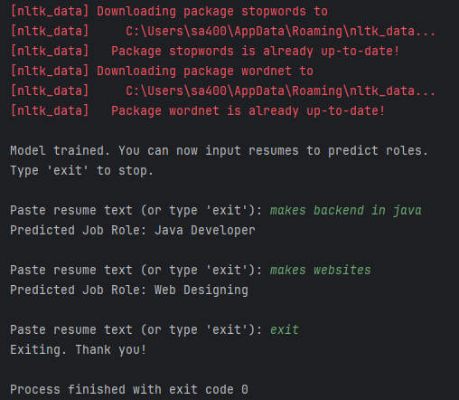

# 🤖 AI Resume Analyzer

This project was developed as part of a 4-week **AI/ML Internship Program** offered by Edunet Foundation in collaboration with AICTE. The aim of this project is to classify resumes into job categories using Machine Learning and Natural Language Processing.

## 📌 Project Objective

Build a machine learning model that can:
- Understand the content of a resume
- Predict the most suitable job category (e.g., Data Science, HR, Web Development)
- Be used interactively to analyze any given resume

## 🧠 Technologies Used

- Python
- Pandas
- NLTK (Natural Language Toolkit)
- Scikit-learn
- TF-IDF Vectorizer
- Multinomial Naive Bayes Classifier

## 📂 Dataset

- Source: [Kaggle Resume Dataset](https://www.kaggle.com/datasets/gauravduttakiit/resume-dataset)
- File: `ResumeDataSet.csv`
- Columns:
  - `Resume`: Text content of the resume
  - `Category`: The labeled job role

## 🚀 How to Run the Project

### 1. Clone this Repository
```bash
git clone https://github.com/sahil-alam444/AI-Resume-Analyzer---Edunet-Internship-Project.git
cd AI-Resume-Analyzer---Edunet-Internship-Project
```

### 2. Install Required Libraries
```bash
pip install pandas scikit-learn nltk
```

### 3. Run the Script
```bash
python main.py
```

### 4. Use the Application
- Paste your resume text into the terminal when prompted.
- Type `exit` to quit the application.

## 🖥️ Sample Output



## 🧑‍🎓 Author

**Sahil Alam**  
B.Tech CSE Student  
Meghnad Saha Institute of Technology  
Edunet AI/ML Internship (May 2025)
